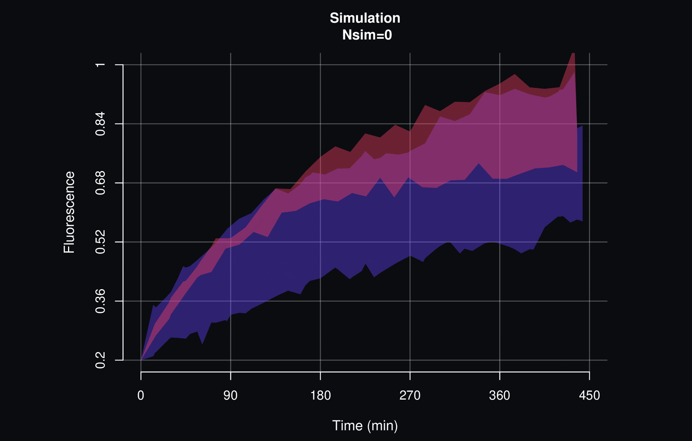

# FRAP Analysis Package

The FRAP Analysis Package is designed to handle and interpret data acquired through the Fluorescence Recovery After Photobleaching (FRAP) technique. It provides a set of main functions to facilitate the analysis and interpretation of FRAP data.

## Features

The FRAP Analysis Package offers the following key features:

1. Standardization and Visualization
   - Standardize and visualize fluorescence data obtained from FRAP experiments.
   - Gain insights into the dynamics of fluorophore recovery.
   
2. Parametric Model Fitting
   - Fit parametric models to the fluorescence recovery curve.
   - Identify the most suitable model that describes the recovery kinetics after photobleaching.
   
3. Statistical Comparison
   - Perform statistical tests to compare fluorescence recovery curves between different datasets.
   - Assess significant differences in recovery kinetics.
   
4. Simulation Methods
   - Utilize simulation methods to increase the effective sample size of your data.
   - Enhance statistical analyses and improve the accuracy of conclusions.

## Installation

To install the FRAP Analysis Package, you can use the `install_github` function from the `devtools` package. Please make sure to also install the required `itz` package from GitHub:

```R
devtools::install_github("artitzco/itz")
devtools::install_github("artitzco/fraping")
```

## Usage

To get started, you can use the `downloadData` function to download a demo dataset and create the file ***test.fraping.R*** in your workspace. The dataset includes FRAP fluorescence recovery data quantified by the Image Fiji software.

```R
fraping::downloadData()
```

For more detailed instructions and examples, please refer to the [User Manual](https://artitzco.github.io/projects/fraping/frapingmanual-en.html) (English version) or [Manual de Usuario](https://artitzco.github.io/projects/fraping/frapingmanual-es.html) (versión en español).

## Contributing

Contributions to the FRAP Analysis Package are welcome. If you encounter any issues or have suggestions for improvements, please submit them in the [Issues](https://github.com/artitzco/fraping/issues) section.

## Associated Article

This project is associated with an article published in the [Microscopy Research & Technique](https://analyticalsciencejournals.onlinelibrary.wiley.com/doi/10.1002/jemt.24533).


## Package Information

- **Package Version**: 0.2.0
- **Author**: Medina Ruiz A. I.
- **Maintainer**: artitzco <[artitzco@proton.me](https://artitzco.github.io/util/contact.html)>
- **License**: GPL-3

This package is released under the GNU General Public License v3.0.

Enjoy analyzing your FRAP data with ease using the FRAP Analysis Package!

----------------



----------------
